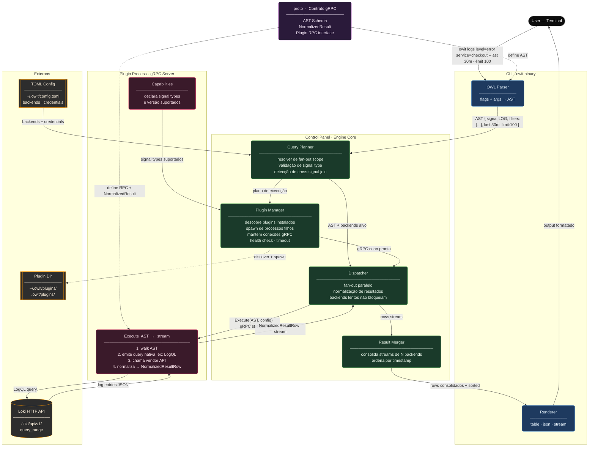
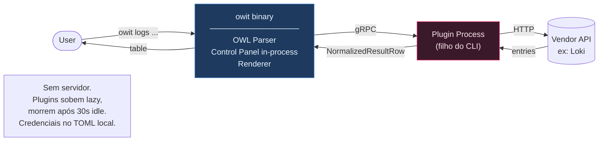
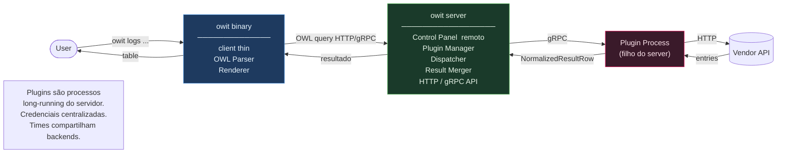
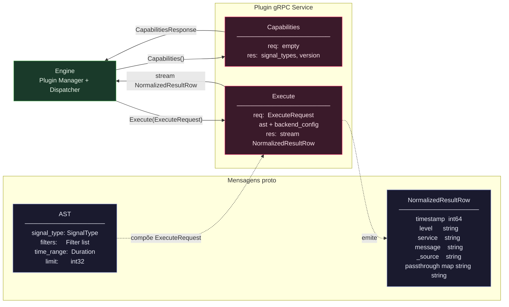

# OpenWatchIt — Architecture

## Component Overview

Visão completa dos componentes e do fluxo de dados de um query de logs via Loki.

---

## Modos de Execução

### Embedded Mode — uso solo, sem infraestrutura

### Remote Mode — uso em time com config centralizada

---

## Contrato gRPC do Plugin

Definido em `.proto` — a fronteira estável entre o engine e qualquer plugin.

---

## Ordem de Implementação — Phase B First

```mermaid
gantt
    title Roadmap de Implementação v0.1
    dateFormat  X
    axisFormat  Passo %s

    section Contrato
    .proto  AST + Plugin RPC + NormalizedResult  :crit, done, p1, 0, 1

    section Plugin Loki  isolado
    gRPC server stub                             :crit, p2, 1, 2
    Tradução AST → LogQL                         :crit, p3, 2, 3
    Chamada Loki HTTP API                        :crit, p4, 3, 4
    Testes de integração  AST hardcoded          :crit, p5, 4, 5

    section Engine Core
    OWL Parser  flags → AST                      :p6, 5, 6
    Plugin Manager  spawn + gRPC lifecycle       :p7, 6, 7
    Dispatcher + Result Merger                   :p8, 7, 8

    section CLI
    owit binary  Embedded Mode                   :p9, 8, 9
    Renderer  table + json                       :p10, 9, 10
```

